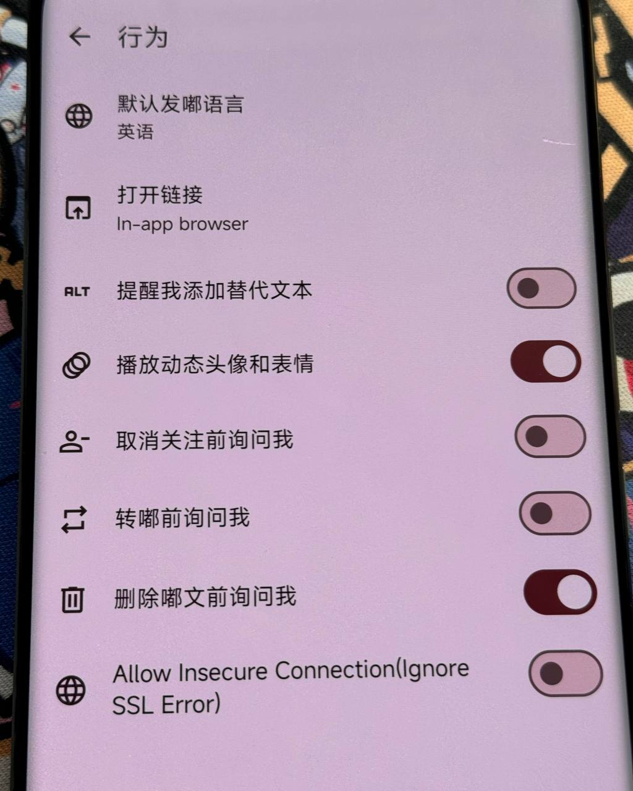

# Mystodon_Android

A modified version of Mastodon that supports ignoring SSL error and CA verification.

一个魔改版Mastodon客户端，支持忽略 SSL 错误和 CA 验证。



### Usage | 使用方法:

1. clone original mastodon [source code](https://github.com/mastodon/mastodon-android) | 下载Mastodon源码.
2. download patches | 下载 patches .
3. apply patches | 应用 patch 到源码 .
4. compile project | 编译 Mastodon.

### Supported Version | 支持版本

v2.5.0

### License | 许可证
GPL v3

```
The Mastodon name and logo are trademarks of Mastodon gGmbH. If you intend to redistribute a modified version of this app, use a unique name and icon for your app that does not mistakenly imply any official connection with or endorsement by Mastodon gGmbH.
```